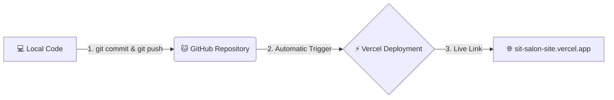

# GitHub & Vercel Deployment Guide 🚀

Apni website ko GitHub pe push karne aur Vercel pe bilkul free me live/deploy karne ke liye niche diye gaye steps ko step-by-step follow karein.

---

## 🏗️ Deployment Workflow

Ye diagram dikhata hai ki kaise aapka local code GitHub ke zariye Vercel pe automatic deploy hota hai:



---

## 🛠️ Step 1: Local Git Commit (Apne Changes Save Karein)

Sabse pehle, apne terminal me niche di gayi commands run karke apne changes ko local Git me save (commit) karein:

> [!NOTE]
> Kyuki aapka local build (`npm run build`) successfully pass ho chuka hai, isliye aapka code deploy hone ke liye 100% ready hai!

```bash
# 1. Apne saare code changes ko stage/select karein
git add .

# 2. Unhe ek message ke saath commit/save karein
git commit -m "Initial commit - SIT Beauty Studio Website"
```

---

## 🐱 Step 2: GitHub pe Push Kaise Karein

1. **GitHub pe login karein**: Sabse pehle [github.com](https://github.com) pe jayein aur login karein.
2. **Naya Repository Banayein**:
   - Right corner me top par plus `+` icon par click karein aur **New repository** select karein.
   - **Repository name** me likhein: `sit-beauty-studio` (ya jo bhi aapko pasand ho).
   - "Public" ya "Private" me se koi ek select karein.
   - **⚠️ IMPORTANT:** Niche diye gaye settings jaise *Add a README file*, *Add .gitignore*, ya *Choose a license* ko **TICK MAT KAREIN** (inke bina blank repo banayein).
   - Sabse niche **Create repository** button par click karein.

3. **Terminal me Commands Run Karein**:
   Jaise hi repository ban jayegi, aapko screen par commands dikhengi. Aapko apne terminal me sirf ye **3 commands** run karni hain:

   ```bash
   # 1. Branch ka naam 'main' set karein
   git branch -M main

   # 2. Apne GitHub repository ko local code se link karein (YOUR_USERNAME ki jagah apna GitHub username likhein)
   git remote add origin https://github.com/YOUR_USERNAME/sit-beauty-studio.git

   # 3. Code ko GitHub par push karein
   git push -u origin main
   ```

---

## ⚡ Step 3: Vercel par Deploy Kaise Karein (Free hosting)

Vercel par deploy karna Next.js ke liye sabse aasan aur best hai. Ye bilkul free hai:

1. **Vercel Website par Jayein**: [vercel.com](https://vercel.com) par jayein aur **Sign Up / Login** karein.
2. **GitHub se Connect Karein**: Login karte waqt **"Continue with GitHub"** par click karein aur permission grant karein.
3. **Import Project**:
   - Vercel dashboard par aate hi, **"Add New..."** button par click karke **Project** select karein.
   - Aapki GitHub repositories ki list dikhegi. Wahan `sit-beauty-studio` search karein aur uske saamne **"Import"** button par click karein.
4. **Configure & Deploy**:
   - Framework preset me Vercel automatic **Next.js** detect kar lega.
   - Aapko kisi bhi settings ko change karne ki zaroorat nahi hai.
   - Bas seedhe niche diye gaye **"Deploy"** button par click karein!
5. **🎉 CONGRATULATIONS!**:
   - Vercel 1-2 minutes me aapka code build karke deploy kar dega.
   - Aapko ek live domain mil jayega (jaise `sit-beauty-studio.vercel.app`) jise aap kisi ke saath bhi share kar sakte hain!

---

## 🔄 Sabse Bada Fayda (Continuous Deployment)
Ab jab bhi aap apne local computer me koi changes karenge, aapko bas ye simple commands run karni hain:
```bash
git add .
git commit -m "Jo bhi change kiya uska message"
git push
```
Vercel automatic aapke changes detect kar lega aur bina kisi manual work ke aapki website ko live update kar dega!
